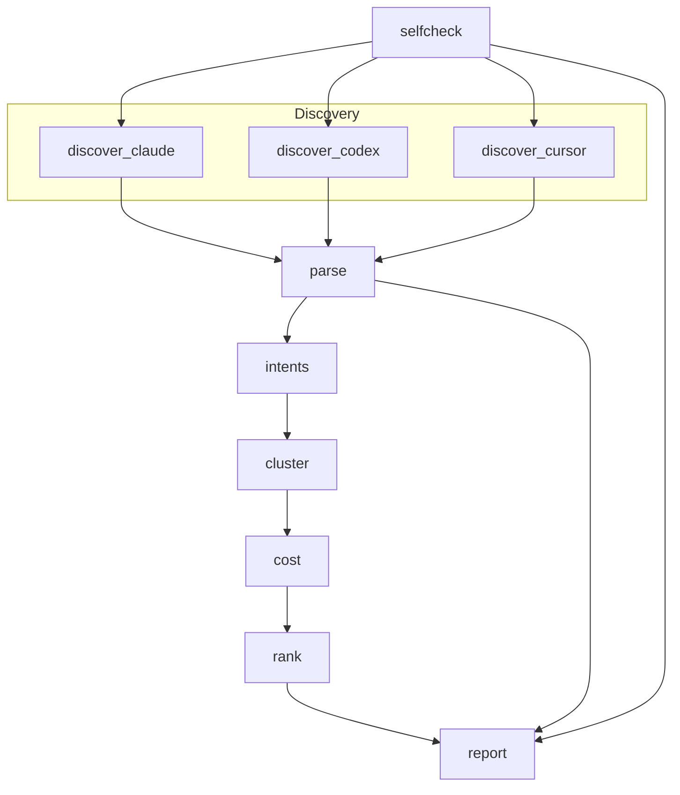

# Groundhog

Groundhog runs on your machine. It reads local session files, writes nothing unless you ask it to, and never opens a network connection. There are no accounts, no API keys, and no uploads. See [PRIVACY.md](PRIVACY.md) and [SECURITY.md](SECURITY.md).

Groundhog reads your Claude Code, Codex, and Cursor session history on this computer and ranks the chores you keep paying an agent to redo. It also measures how often a session starts by re-reading the same files before the first edit.

## Run it

```bash
rote play run https://play.modiqo.ai/gautamtalksdev/groundhog
```

That scan looks back 30 days. From a checkout you can also run `python3 groundhog.py` (14 days by default). Python 3.8 or newer, standard library only. No `pip install`.

## Sample output

This is a real report from the repo's own test fixtures. The scan is partial because the fixture set includes a broken JSONL file on purpose.

```
Self-check: PASSED (7/7 bundled analyzer cases)

GROUNDHOG · 5 sessions · last 30 days · Claude Code

PARTIAL SCAN — NOT A CLEAN RESULT

COVERAGE
  directories checked         4
  agents detected             Claude Code
  files discovered            5
  files parsed                5
  files skipped               0
  sessions analyzed           5
  tool calls analyzed         1
  date range covered          2026-08-22 → 2026-09-03
  sessions with token counts  3
  threshold used              3 distinct sessions
  self-check                  7/7 passed · 12ms

THE WORK YOUR AGENT REDOES EVERY SESSION
  0 sessions had a first edit — not enough to report rates (need 5).
  1 session had no mutating call; not folded into the median

YOU KEEP REDOING THIS

1. Re-run the garak smoke report and compare it to baseline.report.jsonl
   3 times · 2026-09-01 → 2026-09-03 · solen-kernel
   ~7.5k tokens · ~$0.18 (from your logs)
   Solved the same way every time.
   Seen as:
     "Re-run garak smoke report and compare against the baseline json…"   2026-09-03
     "Run garak smoke again and compare the report to baseline.report…"   2026-09-02

WHERE YOUR TOKENS WENT
  solen-kernel   7.5k   $0.18   from your logs

NOT COUNTED
  · Codex history not found on this machine
  · Cursor history not found on this machine
  · 3 malformed lines skipped while reading
  · 1 session had no model id and therefore no cost
  · 1 session had no mutating call; not folded into the median

Local only · read your session files · wrote nothing · sent nothing
```

Dollars print only when the session file itself contained a model id and token counts. Missing usage is labeled in NOT COUNTED. Token totals without a `$` are not a price.

## How it works

The Play is a ten-step DAG in `main.ts`. Self-check runs first. Three discovery steps then run in parallel. Parse waits for all three. Report reads the ranked chores, the parsed sessions, and the self-check artifact.



0. **selfcheck** runs bundled fixture cases through the real analyzer before any user data is read. The first line of the report is `Self-check: PASSED` or a refusal that still prints the findings.
1. **discover_*** walk the harness directories under your home folder and collect `*.jsonl` files whose mtime falls inside the window.
2. **parse** streams each file line by line, smallest first, and stops after about 20 seconds if the pile is huge.
3. **intents** keeps substantive user asks (first ask in a session, plus later turns that look like a new task). Acknowledgements and corrections are dropped.
4. **cluster** groups those asks. A chore counts only when it appears in `min_runs` distinct sessions (default 3). Turns inside one conversation do not count as repeats.
5. **cost** uses token fields from the file when they exist. Otherwise it estimates from text length and labels that estimate. Prices come from the bundled `prices.json`.
6. **rank** orders clusters by frequency, cost, stability, and recency.
7. **report** prints the self-check line, the verdict, the coverage ledger (including self-check cost), the rediscovery section, the ranked chores, project token totals, and NOT COUNTED.

The CLI (`groundhog.py`) runs the same logic in one process.

## Verdict classes

The verdict is the first line under the header. A partial scan never renders as a clean null.

| Verdict | When it fires |
|---------|----------------|
| `ANALYZER FAILED ITS OWN SELF-CHECK — FINDINGS BELOW CANNOT BE RELIED ON` | A bundled fixture case failed. The report still prints findings and names what the verdict would otherwise have been. This is never a clean result. |
| `NO SUPPORTED HISTORY FOUND` | Every harness directory is absent. |
| `PARTIAL SCAN — NOT A CLEAN RESULT` | A harness directory was unreadable, a session file was skipped, a JSONL line was malformed, the 20-second parse budget stopped the walk, or a pipeline stage failed. This wins even if clusters were found. |
| `INSUFFICIENT HISTORY` | The scan was clean and fewer than `min_runs` sessions were parsed. |
| `REPEATED WORK FOUND` | The scan was clean and at least one chore met `min_runs` distinct sessions. |
| `DEFENSIBLE NULL` | The scan was clean, there were enough sessions, and nothing repeated at the threshold. |

## What it cannot see

- Any tool that does not write `*.jsonl` session files under the paths below
- Files whose mtime is older than the window (CLI default 14 days, Play default 30)
- Session content on another machine or another OS user
- The files your agent edited. Tool records contribute a path string and a shell command string from the transcript. The file bytes on disk are not opened.
- A dollar cost when the transcript has no model id, or has no token counts. Groundhog will not invent a measured price.

NOT COUNTED lists what was missing, skipped, estimated, or unread.

## Supported harnesses

Discovery roots are under `$HOME`. Only `*.jsonl` files are opened. Directory symlinks are not followed (`os.walk(..., followlinks=False)`). A `.jsonl` file symlink is kept only when `Path.resolve()` lands inside the harness root it was found under. Otherwise it is named in NOT COUNTED and never parsed.

| Harness | Directories | What Groundhog reads from those files |
|---------|-------------|----------------------------------------|
| Claude Code | `~/.claude/projects/` | Session id, project/cwd, timestamps, user and assistant turn text, tool-use blocks, `model`, and usage (`input_tokens` / `output_tokens` / `cache_read_input_tokens`, including camelCase aliases). |
| Codex | `~/.codex/sessions/`, `~/.codex/history/` | The same kinds of fields, nested under Codex `payload` shapes (`user_message`, `response_item`, and so on). |
| Cursor | `~/.cursor/projects/<dir>/agent-transcripts/` | User and assistant text (including `<user_query>` wrappers), timestamps, and tool-use blocks. Cursor transcripts often omit `model` and usage. When those keys are present they are read. |

## Python floor

Python **3.8+**. Standard library only. `deps.toml` requires `python3 >=3.8`. There is no `requirements.txt`.

## How to read an empty result

Match the verdict, then read YOU KEEP REDOING THIS and NOT COUNTED.

- **No supported history.** Those three directory trees are not on this machine. Install paths and OS user are the usual reasons.
- **Insufficient history.** The directories exist. Fewer than `min_runs` sessions fell in the window. Widen `--days` or wait. The report will not tell you to raise the threshold.
- **Defensible null.** Enough sessions were parsed. Nothing repeated across `min_runs` distinct sessions. That is a real finding. For a 30-day window the report says most people need several months before chores cluster. For a shorter window it suggests `--days 30`. If `min_runs` is still 3 it also suggests `--min-runs 2`.
- **Partial scan with no chores listed.** Treat coverage as incomplete. Fix the unreadable path or the broken file, or accept that the 20-second budget stopped early.

A missing Claude Code or Codex install is listed in NOT COUNTED. It does not, by itself, make the scan partial if the remaining harness parsed cleanly.

## License

[MIT](LICENSE). How to contribute: [CONTRIBUTING.md](CONTRIBUTING.md).
